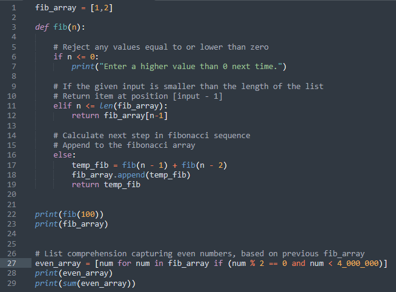
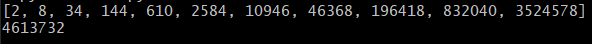

% Completed, July 2021

# Even Fibonacci numbers -- Project Euler, Problem 2

### Example: Each new term in the Fibonacci sequence is generated by adding the previous two terms. By starting with 1 and 2, the first 10 terms will be:

						1, 2, 3, 5, 8, 13, 21, 34, 55, 89, ...

### Goal: By considering the terms in the Fibonacci sequence whose values do not exceed four million, find the sum of the even-valued terms.

For this problem, we are asked to find the Fibonacci sequence for up to, and including, four million and finding the sum of all even terms. 

To begin solving, I began a fibonacci array consisting of 1 and 2. To extend the fibonacci sequence, I created a function to accept all values over zero and extend the array to the specified number of steps.

For sorting through the generated values, I used a list comprehension based on the results contained in "fib_array" and using an if-statement I checked to see if terms were divisible by 2 and less-than-or-equal-to 4,000,000.

## Solution:	The sum of the even-valued terms in the Fibonacci sequence whose values do not exceed four million,  *4613732*

